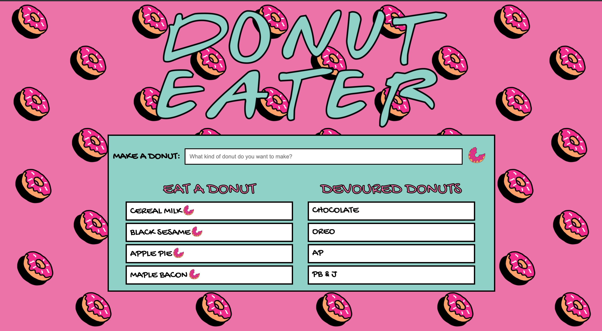

# DONUT EATER

Node Express Handlebars

### Overview

This is a simple one page site that loggs with MySQL, Node, Express, Handlebars and a homemade ORM. Donut Eater uses an MVC design pattern to query and route the donuts, Handlebars to generate HTML, and deployed with Heroku


### What it is 

* Donut Eater is a donut shop app that lets users input the names of donuts they'd like to make, and then eat them!!.

* Whenever a user submits a donuts's name, your app will display the donut on the left side of the page -- waiting to be devoured.

* Each donut in the waiting area also has a `Devour it!` button in the shape of a donut. When the user clicks it, the donut will move to the right side of the page, under the list of devoured donuts. 

* The app stores every donut in a database, whether devoured or not.



public/assets/Screenshot.png


### Directory structure
```
├── config
│   ├── connection.js
│   └── orm.js
│ 
├── controllers
│   └── burgers_controller.js
│
├── db
│   ├── schema.sql
│   └── seeds.sql
│
├── models
│   └── burger.js
│ 
├── node_modules
│ 
├── package.json
│
├── public
│   └── assets
│       ├── css
│       │   └── burger_style.css
│       └── img
│           └── burger.png
│   
│
├── server.js
│
└── views
    ├── index.handlebars
    └── layouts
        └── main.handlebars
```
